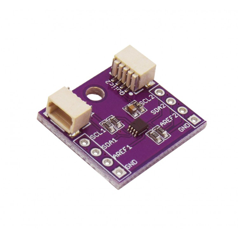

# Zio Qwiic Level Translator (PCA9306)

> This product can be available for purchase [here](https://www.smart-prototyping.com/Zio-Qwiic-Level-Translator-PCA9306).

#### Description

Does your project use components with different voltages? There must be a way to match the output level of one device with the input voltage level of another device.To allow a proper translation of I2C signals from one voltage reference to another, both the high-level and low-level voltage thresholds need to be translated. No worries, we got you covered with the ZIO Qwiic Level Translator allowing bidirectional voltage translation from 1V to 3.6V and 1.8V to 5.5V on the high side.  

The board features a PCA9306 Dual bidirectional I2C bus and SMBUS voltage level translator without the use of a direction pin. Not only capable to match voltages but also frequencies, so it can be used to run two buses at different frequencies. One at 400 kHz operating frequency, and the other at 100 kHz.

As part of our Qwiic family, the setup is basic, just connect the lower voltage part to the connector next to SCL1, SDA1 and AREF1. The higher voltage part is connected the opposite connector next to SCL2, SDA2 and ARED2. 

We’ve also included the pinout in case you want to have the access directly to the connections. 

#### Specification

* Interface: I2C
* Allows voltage level translation between:
  * 1.0 V Vref(1) and 1.8 V, 2.5 V, 3.3 V or 5 V Vbias(ref)(2)
  * 1.2 V Vref(1) and 1.8 V, 2.5 V, 3.3 V or 5 V Vbias(ref)(2)
  * 1.8 V Vref(1) and 3.3 V or 5 V Vbias(ref)(2)
  * 2.5 V Vref(1) and 5 V Vbias(ref)(2)
  * 3.3 V Vref(1) and 5 V Vbias(ref)(2)
* Provides bidirectional voltage translation with no direction pin
* Less than 1.5 ns maximum propagation delay to accommodate Standard-mode and Fast-mode I2C-bus devices and multiple masters
* Low 3.5  ON-state connection between input and output ports provides less signal distortion
* Dimensions: 18.4 x 19.9mm
* Weight: 1.2g

#### Links

* [Eagle File and Schematic](https://github.com/ZIOCC/Zio-Qwiic-Level-Translator-PCA9306)
* [PCA9306 Datasheet](http://www.ti.com/lit/ds/symlink/pca9306.pdf)

> ###### About Zio
> Zio is a new line of open sourced, compact, and grid layout boards, fully integrated for Arduino and Qwiic ecosystem. Designed ideally for wearables, robotics, small-space limitations or other on the go projects. Check out other awesome Zio products [here](https://www.smart-prototyping.com/Zio).
